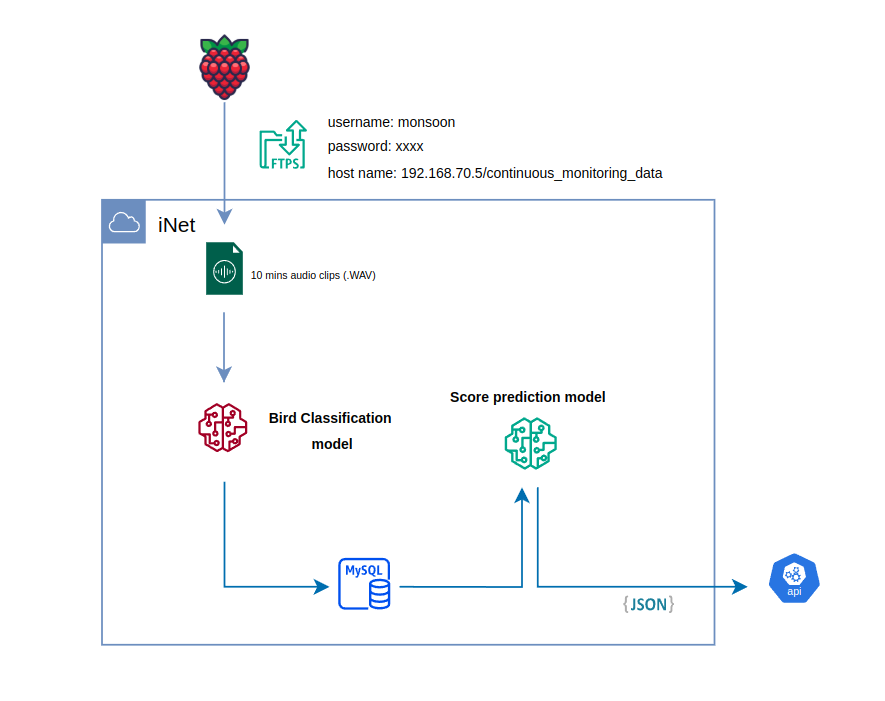

# Bird Sound Monitoring & Scoring Pipeline

This automates the process of monitoring bird sounds from IOT devices, classifying them using soundscape model, predicting scores based on classification results, and sending the output to an API in JSON format.

---



#### Data Source (Raspberry Pi)
- **Device:** IOT devices (Raspberry Pi + Audiomoth sensors) for audio data collection.
- **Protocol:** FTPS (secure FTP) is used for secure file transfer.
- **Destination:** Files are uploaded to the iNet private cloud:

---

#### Audio Collection
- The Raspberry Pi uploads **10-minute audio clips** in `.WAV` format.

---

#### Bird Classification Model
- The audio clips are processed by a **Bird Classification Model**.
- This model performs inference/classification to identify bird species. 
- The classification results are stored in a **MySQL database**.

---

#### Score Prediction Model
- The **Score Prediction Model** retrieves classification results from MySQL.
- It predicts a **score** based on the results of the bird classification.

---

#### API Output
- The predicted scores are formatted as **JSON**.
- The JSON output is sent to an **API endpoint** for further use

---

| Component                | Description                                  |
|--------------------------|----------------------------------------------|
| Raspberry Pi + Audiomoth + 4G router        | Collects audio data                          |
| FTPS                     | Secure transfer protocol                     |
| iNet Server              | Inferencing machine               |
| Bird Classification Model| Identifies bird sounds from audio            |
| MySQL                    | Stores classification results               |
| Score Prediction Model   | Predicts score based on classification       |
| API                      | Receives JSON payloads from score model      |


---

### Example usage 

- Build and Run 
```bash
sh scripts/build_prod_image.sh
docker compose -f docker/docker_compose_prod.yaml up -d
```

| File structure overview            |                            |
|--------------------------|----------------------------------------------|
| app-data/              | Stores the SQLite database used for predictions and classifications                               |
| audio-data/      | Path to input .wav audio files ( continuous-monitoring-data)            |
| src/soundscape.py  |   Monitors audio directories, runs bird sound classification, saves results to database         |
| src/process_detections.py |   Retrieves classifications, runs score prediction, and generates JSON output |
| logs/ |   `audio_inference.log` – logs classification & monitoring <br> `daily_report.log` logs API submission results  |
| json-output/ |   Stores JSON files ready for API submission |
| weights/ |   `soundscape-model` - bird classifier <br> `xgboost-model` - score predictor |

- To follow real-time logs from the production container:
```bash
docker logs -f prod-bio-service -f
```


